# Results of Testing

The test results show the actual outcome of the testing, following the [Test Plan](test-plan.md)


## Testing UI init

Does the game show instructions and the mainwindow with planet, location and inventory info?

### Test Data To Use

Run the program in your preferred way.

### Test Result

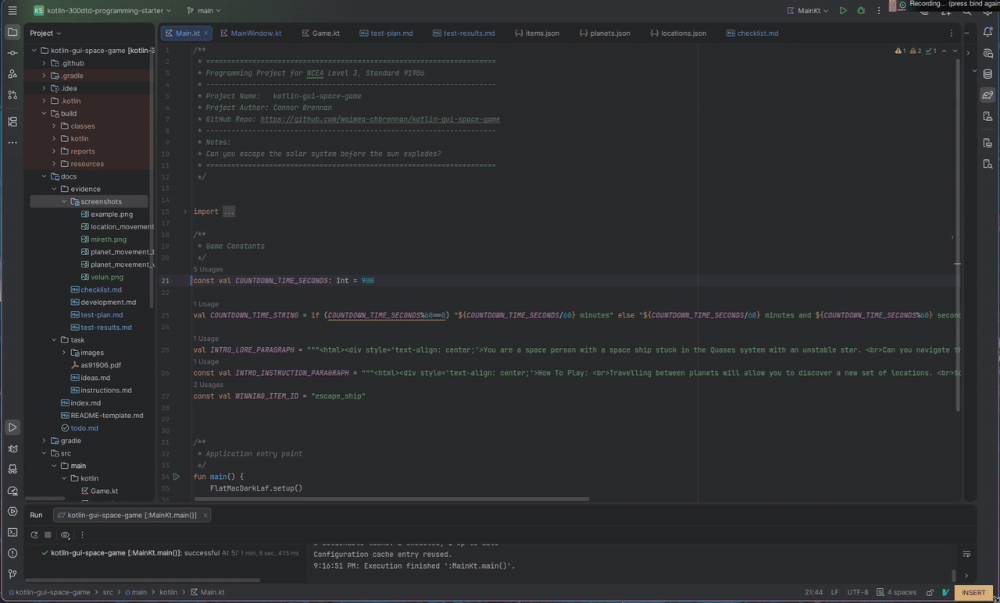

This aligns with the rough layout of the mainwindow and so is satisfactory.
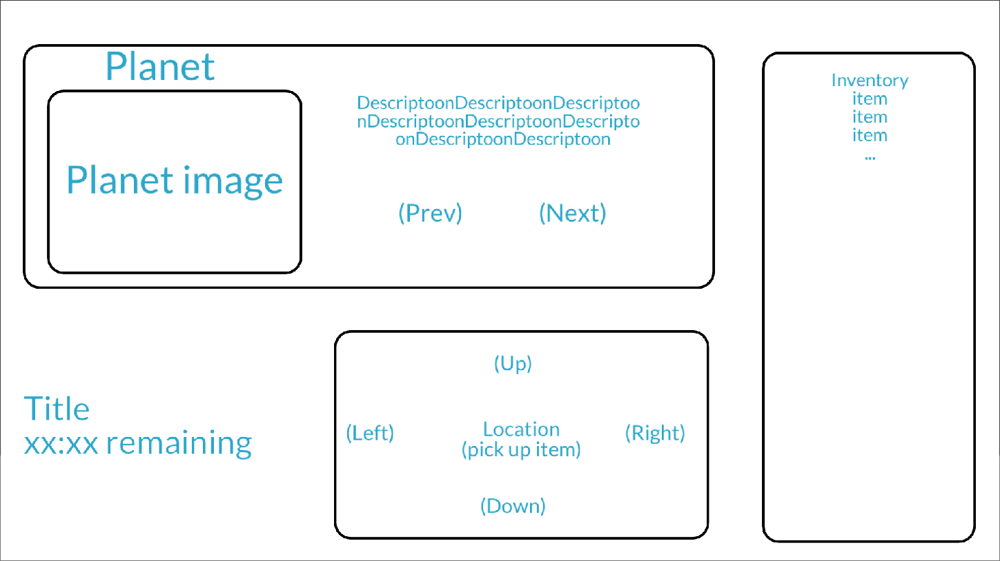


During the testing of this, I noticed an error in the display of the countdown timer where when there was supposed to be less than 10 seconds left in the minute, it would show the number with an appended 0
so instead of showing 1:09 it would show 1:90

**Close up of this error:**


This was caused by an error in the initial code:

```kotlin
// Title Panel ---------------------------------
//Show time as m:ss || mm:ss rather than m:s
currentTimeLabel.text = "${game.currentTime/60}:${(game.currentTime%60).toString().padEnd(2,'0')}"
```
we can see the error comes from the .padEnd(2,'0') where it will append a 0 to a single character if needed.


this should be prepended instead so change to .padStart():

```kotlin
currentTimeLabel.text = "${game.currentTime/60}:${(game.currentTime%60).toString().padStart(2,'0')}"
```

**Re-testing**:


And this result is satisfactory.

---

## Testing Planet Movement: VALID

Can the player move left and right from planet to planet?

### Test Data Used

Click the next and previous planet buttons while on a planet not on the boundary of the planets list.
`Starting on Mireth - click next`
`Starting on Crael - click previous`

### Test Result


As expected, moving next/right from Mireth moves to Crael with the UI updating to show as such and vice versa.

---

## Testing Planet Movement: BOUNDARY

Testing ability to move and from to the first and last planet without error.

### Test Data Used

Since the planet objects are stored in a list, it is important to consider the cases where an off by one error would cause undefined behaivour or and index out of bounds.
Thus, we need to test functionality when moving to and from Velun and Presso.

`Starting Mireth - click previous`
`Starting Crael - click next`

### Test Result


As expected, we can travel to the extremum of our planets list (velun and presso) without any errors.

---

## Testing Location Movement: VALID

Testing whether we are able to move in a given direction (up down left right) between locations on planets if there is a corresponding node in that direction.

### Test Data Used

`Velun, Upper pressurised tunnel - click south`
`Mireth, Perimeter Gate - click north`
`Mireth, Perimeter Gate - click east`
`Mireth, Desert Flats - click west`

### Test Result


In each case, the game updated the current location label and what buttons were enabled to use to travel. This is the expected behaviour.

---


## Testing Planet Movement: INVALID 

The player should not be able to move outside of the list of planets as this would cause a crash.

### Test Data Used

`Velun - click previous`
`Presso - click next`

### Test Result
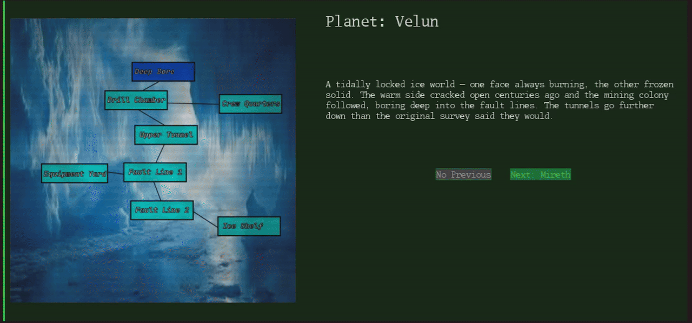
As expected, the game disabled these buttons for our test data so the input is ignored and the game continues without error.

---


## Location Movement: BOUNDARY

How does the game cope when the player moves to locationNodes that are on the edges of the map?

### Test Data Used
Player has cold gear in inv
`Velun, fault line mouth - click left`

placing them in the boundary node:
`Velun, Surface Equipment Yard - click right`

This confirms there are no issues travelling into and out of these boundary nodes and that everything works as expected there
### Test Result


The game handles moving to this boundary node and back again without error and has no issue with state of boundary node with
expected behaivour of movement buttons, title, and item pick up.

---


## Test Item Pickup: VALID
Test whether the player can pick up an item from a location with an item in it.

### Test Data Used
`Mireth, evacuated barracks - click pick up`

### Test Result

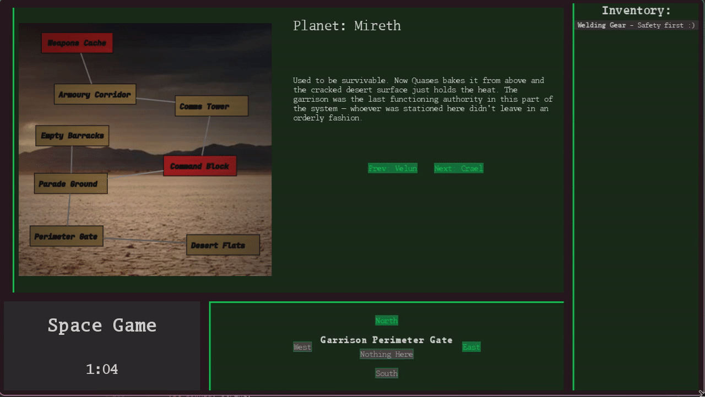

On clicking pick up the item is indeed added to the player inventory but it is still listed in the location as available to pick up.
Clicking this multiple times could cause undefined behaivour or just confuse the player so we need to make sure the item is displayed as removed from location.

I investigated this issue and found it stemmed from the following code in Game.kt as I forgot to remove it from the map when making the function:
```kotlin
/**
 * Moves an item that may be contained in current location to our inventory.
 */
fun pickupItem() {
    if(locationItem==null) return
    inventory.add(locationItem!!)
}
```
This function checks for a valid item before adding it to our inventory but we can remove it from the map here as well.

```kotlin
/**
 * Moves an item that may be contained in current location to our inventory.
 */
fun pickupItem() {
    if(locationItem==null) return
    inventory.add(locationItem!!)
    items.remove(locationItem) //Don't want to pick up same item multiple times
}
```

Re-running same test:

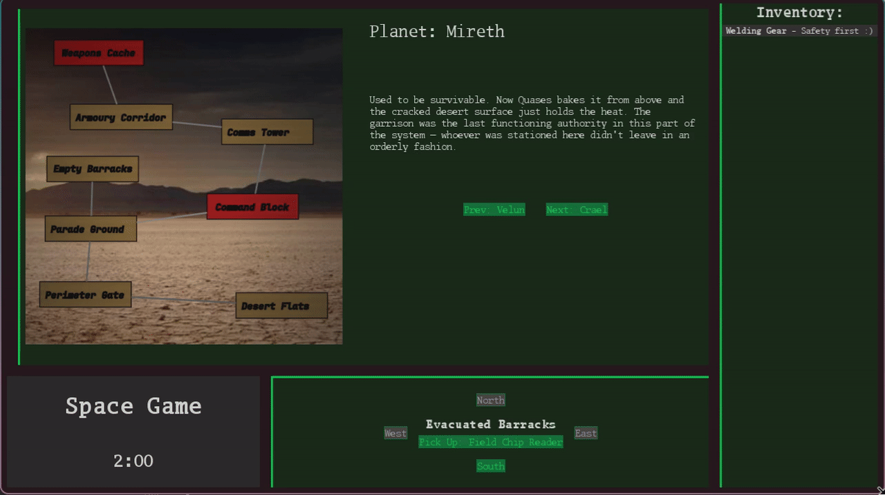
Here the pickup button is disabled after the player collects item so they cannot collect it twice and so this test now passes.

---


## Test Item Pickup: INVALID
I will test how the player trying to pick up an item is handled when there is no item in location to acquire.

### Test Data Used

`Mireth, Garrison Perimeter Gate - click pick up`

### Test Result

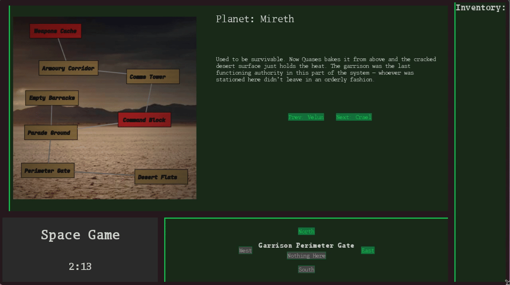
As expected, the pick up button is disabled when there is no valid item to pick up in the location and so the clicks 
to pick up an invalid item are ignored and the game does enter undefined behaviour
---


## Test Location Movement: INVALID

Test how the game handles the player trying to move off the map to a node that does not exist.
### Test Data Used

`Velun, Cracked Ice Shelf - click south`
`Mireth, Communications Tower - click north, east`
### Test Result


As desired, we cannot move in a direction that does not have a location as this would cause error and so disabling
the location movement buttons that do not point at a valid location deals with this otherwise invalid case.

---


## Test Item Enable: VALID

What happens when the player picks up another item that satisfies the dependency of an item in their inventory?

### Test Data Used

Player on Velun travels to pick up Welding Gear, Welding Torch (cold gear also need to reach welding torch).
Test what happens when they pick up the replacement ignitor from Crew Quarters.

### Test Result

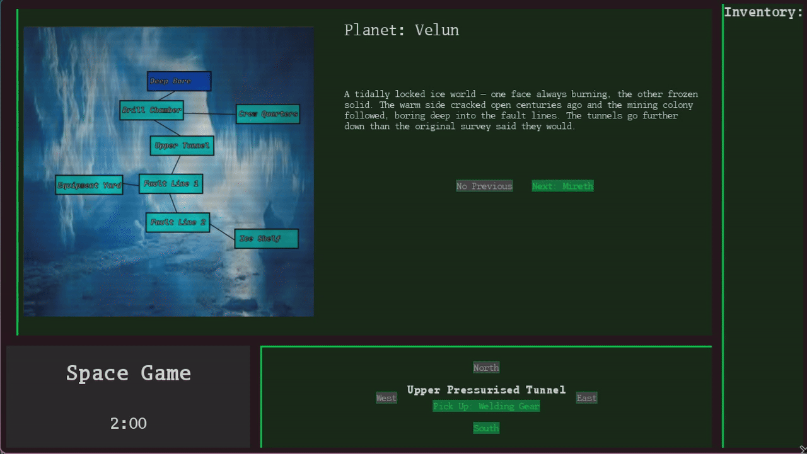

As expected, picking up the replacement ignitor causes the entire dependancy chain (Welding Gear and Welding Torch) to be satisfied
which means we can show the enabled description of the parent item (Welding Torch) and hide all the child items as they are no longer relevant.

---


## Testing Location Movement: BOUNDARY/EDGE

Test whether locked locations are not able to be travelled to if player does not have correct item. This is a different case than if there simply is no location so 
it is important to check to ensure robustness.

### Test Data Used

Player missing enabled gas torch in their inventory.
`Velun, Drill Chamber - click north`

### Test Result

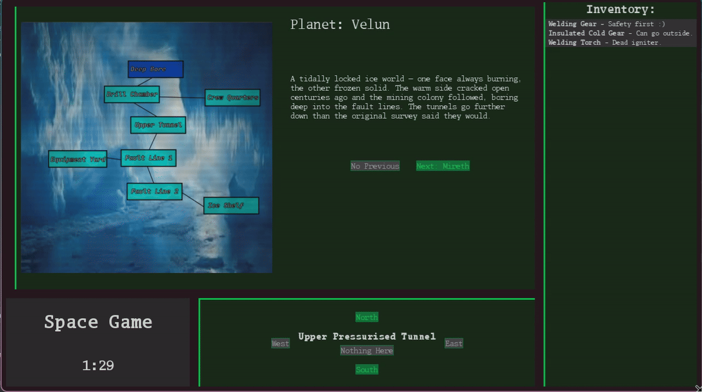

---


## Testing Location Unlock: VALID
What happens when the player has an item in their inventory, and they try to go to a location locked with that item?

### Test Data Used
`Crael, Surface dock - pick up debris cutter - click right`


### Test Result

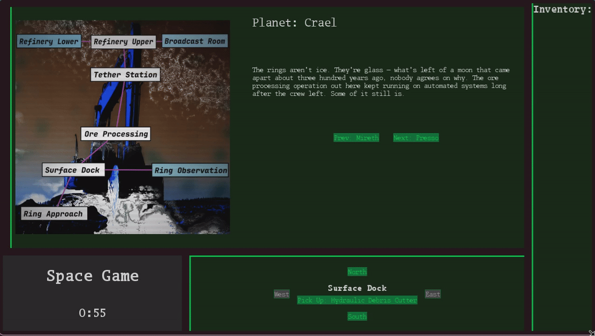

Since the location to the right of the surface dock needs the debris cutter, it was disabled until the cutter was collected
then was unlocked and moved to and from without issue, thus passing expected behaviour.

---


## Testing Location Unlock: BOUNDARY/EDGE

What happens when the player has the required item to unlock a location, but it is not enabled?

### Test Data Used
on Velun, player needs to collect Welding Gear, the welding torch and collect new ignitor before navigating to the Drill Chamber where they then try to move North into the Deep Bore Terminal.

### Test Result


We only want the player to be able to move into a location when the needed item has been fully satisfied so 
Deep Bore should remain locked until all three of the lighter, torch, and safety gear are collected.
This test passes this expected behaviour.

---


## Testing Win and Lose Screens

Can the player win by getting the hyprdrive ship and lose by running out of time?
### Test Data Used

Losing the game: sit around and wait to explode (timer running out)

Winning: Try hard to navigate quickly to unlock the Presso Drill Arm Bay where the ship is stored.

### Test Result
**Losing:**
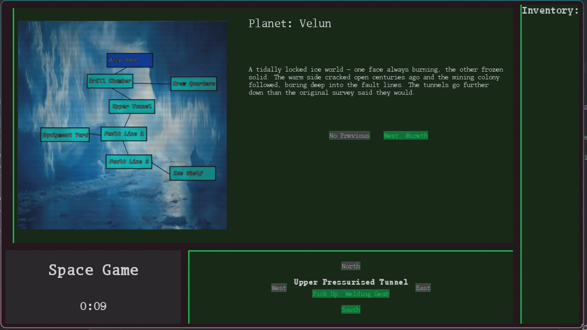
**Winning:**
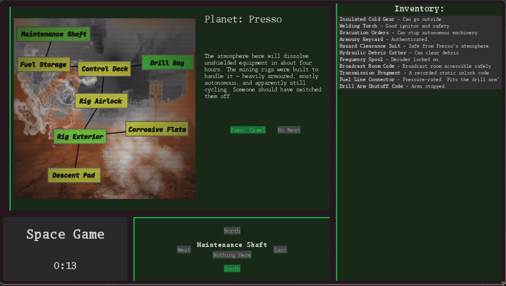

The win and lose screens are both shown correctly at the correct times and so this test passes

---


## Testing JSON Validation: INVALID/BOUNDARY

How does the game cope if the JSON for the planets, items, and locations is modified to be invalid/ not make sense?

### Test Data Used

1. `change Presso startLocationId to some_invalid_location `
2. `change presso_maintainance_shaft downId from presso_fuel_storage to presso_drill_arm_bay` valid but non mutual location thus edge case
3. `change crael_transmission_fragment locationId to some_invalid_location`
4. `change velun_ignitor_patch id to some_invalid_item_id` to test item dependency chains

### Test Result

1. invalid startlocationid

```json
{
    "name": "Presso",
    "description": "The atmosphere here will dissolve unshielded equipment in about four hours. The mining rigs were built to handle it — heavily armoured, mostly autonomous, and apparently still cycling. Someone should have switched them off.",
    "distance": 97000000,
    "startLocationId": "some_invalid_location",
    "imageFile": "images/presso.png"
  }
```
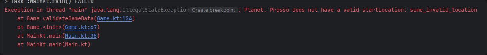

As expected, the game fails to run immediately and provides a useful error message which is more defined and consistent
behaviour. Happy with this test result.

2. boundary non matching/mutual location reference

```json
{
"id": "presso_maintenance_shaft",
"name": "Maintenance Shaft",
"lockedByItemId": "crael_transmission_fragment",
"upId": "",
"rightId": "",
"downId": "presso_drill_arm_bay",
"leftId": ""
}
```

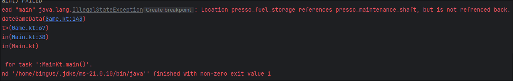

The program has stopped as expected and the error message provides the correct information as to diagnose the problem.

3. invalid item location placement

```json
{
    "id": "crael_transmission_fragment",
    "name": "Transmission Fragment",
    "enabledDescription": "A recorded static unlock code.",
    "disabledDescription": "Terminal locked.",
    "dependsOn": null,
    "locationId": "some_invalid_location"
}
```
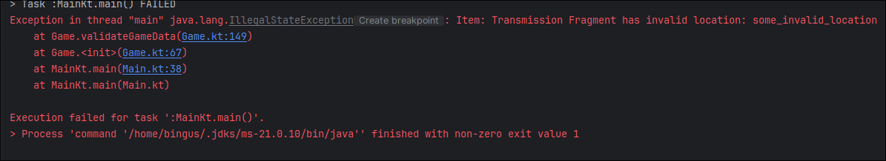
This error is expected as if we cannot place item in location then there would be no way to pick it up and so the game would not be winnable.

---


