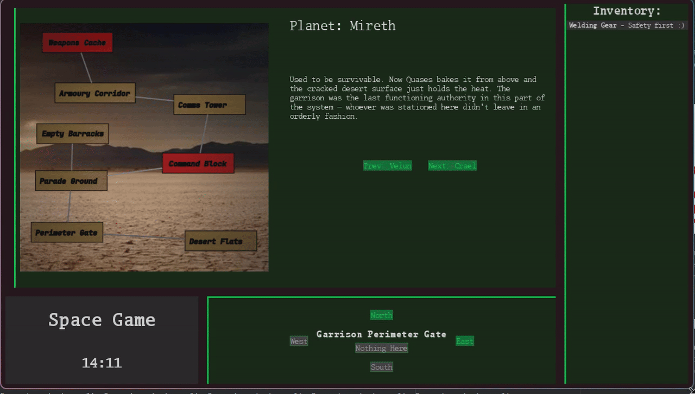
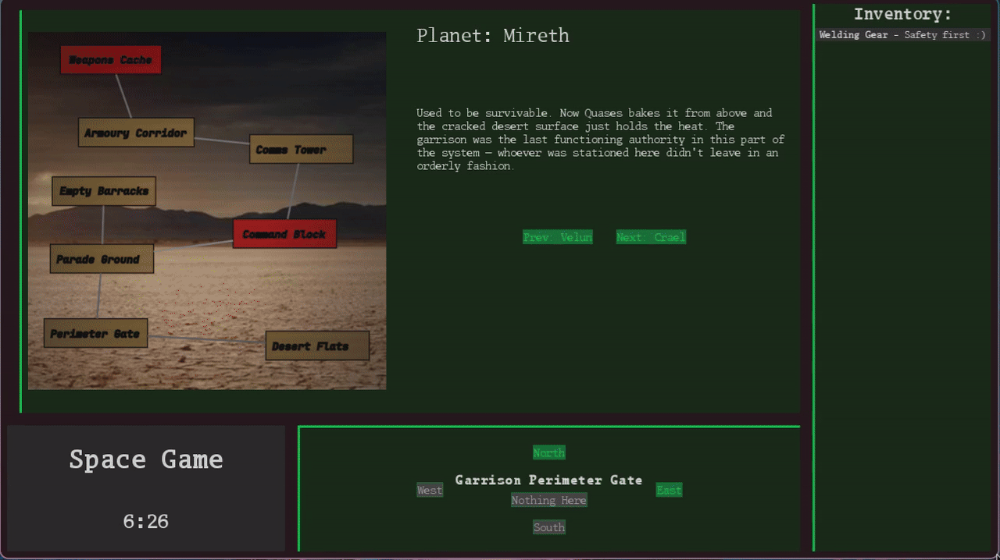
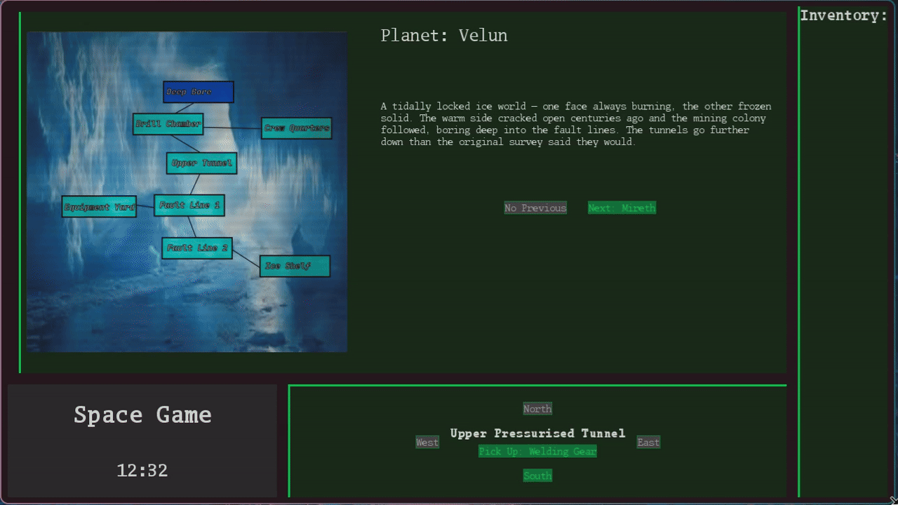

# Results of Testing

The test results show the actual outcome of the testing, following the [Test Plan](test-plan.md)

Correct .padEnd -> .padStart

---

## Testing Planet Movement: VALID

Can the player move left and right from planet to planet?

### Test Data Used

Click the next and previous planet buttons while on a planet not on the boundary of the planets list.
`Starting on Mireth - click next`
`Starting on Crael - click previous`

### Test Result

As expected, moving next/right from Mireth moves to Crael with the UI updating to show as such and vice versa.

---

## Testing Planet Movement: BOUNDARY

Testing ability to move and from to the first and last planet without error.

### Test Data Used

Since the planet objects are stored in a list, it is important to consider the cases where an off by one error would cause undefined behaivour or and index out of bounds.
Thus, we need to test functionality when moving to and from Velun and Presso.

`Starting Mireth - click previous`
`Starting Crael - click next`

### Test Result

As expected, we can travel to the extremum of our planets list (velun and presso) without any errors.

---

## Testing Location Movement: VALID

Testing whether we are able to move in a given direction (up down left right) between locations on planets if there is a corresponding node in that direction.

### Test Data To Use

`Velun, Upper pressurised tunnel - click south`
`Mireth, Perimeter Gate - click north`
`Mireth, Perimeter Gate - click east`
`Mireth, Desert Flats - click west`

### Test Result

In each case, the game updated the current location label and what buttons were enabled to use to travel. This is the expected behaviour.

---

